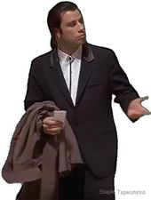
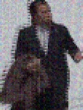
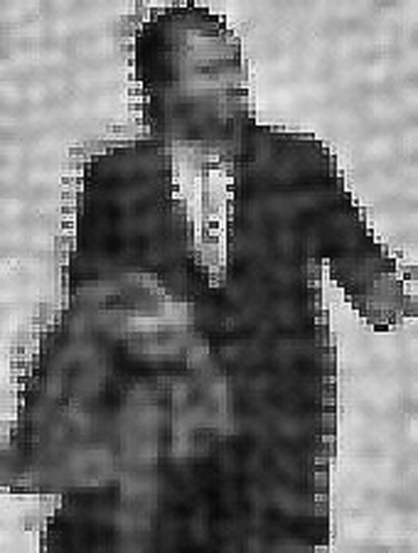
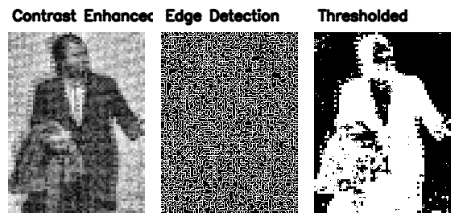
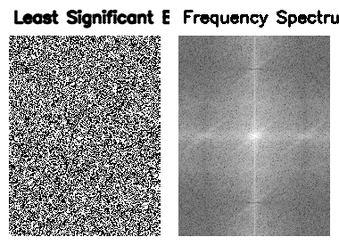
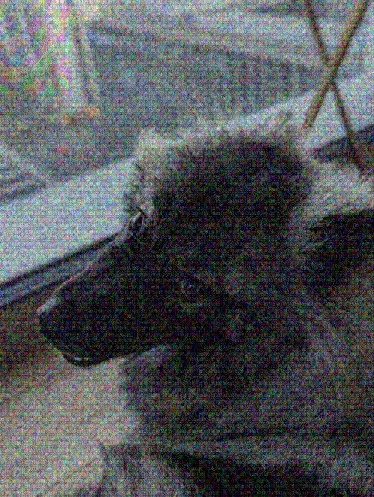

# Adversarial Attack Repository

This repository contains implementations of various adversarial attack methods on neural networks. It is designed to help researchers and practitioners explore adversarial robustness and test different attack strategies against deep learning models.


## Examples
Initial image:



Detection before:
```
🖼️ Image: privat1/images/th3.jpeg
  - suit (ID 835) -> Confidence: 6.3251
  - ski mask (ID 797) -> Confidence: 5.3537
  - abaya (ID 400) -> Confidence: 5.3193
  - trench coat (ID 870) -> Confidence: 5.1354
  - Windsor tie (ID 907) -> Confidence: 4.6823
❌ Forbidden object detected!
```

Obfuscated image:



Detection After 
```
🖼️ Image: privat1/converted/examples/minimal_adv_all_cbbdddb1ae7a55a3.jpeg
  - jigsaw puzzle (ID 612) -> Confidence: 8.2029
  - fur coat (ID 569) -> Confidence: 6.1599
  - bearskin (ID 440) -> Confidence: 5.8124
  - chain mail (ID 491) -> Confidence: 5.3193
  - monastery (ID 664) -> Confidence: 5.2024
✅ Success: No forbidden objects detected.
```

be aware this was run using a combination of all attacks, which is not alwass the best performing option. it was also done using a general target. For best result the target should be choosen sperately for each input image. f.e. for the above a good target might be "abaya" since it already has some confidence there and we could throw it off completely.

More examples are available under: 
[Examples](converted/examples)

## Enhancing & analysis
Examples and tools in /revert

### Enhance1 (contrast enhancement):



Enhance 1 can help better identify the subject of an image.

### Enhance2 (edge detection & thresholding):



As you can see Enhance2's edge detection miserably fails on our protected image. however using threshold we could still make it work.

### Enhance3 (LSB analysis and frequency spectrum):



As you can see even tho we have data embedded in the image the lsb pattern is radnomized very well, making it hard to detect hiddne data. the Frequency spectrumg gives hints to a trained eye that the image has been edited, but also here is to much randomness.

below is a example from ehance 2 & 3 on an unedited image:


As you can see on an unedited picture the patterns are quite different. With enhance 2 you can clearly see the subjects outlines and edges in all pictures. With using enhance 3 you can see a more natural pattern for the LSB analysis, thsi is to be expected. in the FS you can clearly see how clean the lines would be on a standard camera captureed image. 

## Getting Started

The main entry point for this repository is **`privat1_tf.py`**. This script orchestrates the adversarial attacks, applies transformations to input images, and integrates various attack implementations.

### Files Overview

#### 1. `privat1_tf.py` (Main Script)
- Loads and preprocesses images.
- Applies multiple adversarial attack methods (FGM, PGD, Carlini-Wagner L2).
- Uses TensorFlow Hub models for classification.
- Includes additional image transformations such as pixel shifting, noise injection, and metadata manipulation.
- Outputs adversarially perturbed images with optional metadata stripping.

#### 2. `carlini_wagner.py`
- Implements the **Carlini & Wagner L2 (C&W) attack**.
- Generates adversarial perturbations using optimization-based techniques.
- The perturbations are computed on a downsized 224x224 image and upscaled to preserve detail before being applied to the original image.

#### 3. `FGM.py`
- Implements the **Fast Gradient Method (FGM)**.
- Perturbs input images along the gradient direction.
- Similar to the PGD method but with a single-step perturbation.
- Uses downscaled images for computation, then upsizes the perturbation to minimize resolution loss.

#### 4. `PGD.py`
- Implements the **Projected Gradient Descent (PGD) attack**.
- Iteratively updates adversarial perturbations with projected steps to remain within a constrained epsilon range.
- Preserves image detail by computing perturbations on a lower-resolution version and upscaling them before application.

#### 5. `helpers.py`
- Contains utility functions, including a TensorFlow Hub classifier loader.
- Loads a MobileNetV2-based ImageNet classifier.
- Wraps the classifier using the `art` (Adversarial Robustness Toolbox) framework for use in adversarial attacks.

## Running the Code

This repository is currently only compatible with macOS, as it relies on tensorflow-macos and tensorflow-metal for acceleration. Ensure that you have the required Python libraries installed before running the scripts:
```
pip install -r requirements.txt
```
Then, to run an attack, execute:
```
python privat1_tf.py
```

## Contribution
Feel free to contribute by improving existing implementations, adding new adversarial attacks, or refining the evaluation metrics.

## License
This project is released under an open-source license. Use it for research and educational purposes only.

## advanced usage

analyze input image using imagenet using verify.py
```
🖼️ Image: /Users/lwlx/PROJECTS/privat1/images/img4sm.jpeg
  - keeshond (ID 262) -> Confidence: 8.0951
  - schipperke (ID 224) -> Confidence: 5.3002
  - groenendael (ID 225) -> Confidence: 4.9950
  - Pomeranian (ID 260) -> Confidence: 4.9746
  - langur (ID 375) -> Confidence: 4.5492
  - indri (ID 385) -> Confidence: 3.5839
  - Shetland sheepdog (ID 231) -> Confidence: 3.4943
  - Chihuahua (ID 152) -> Confidence: 3.4302
  - Norwegian elkhound (ID 175) -> Confidence: 3.3912
  - Madagascar cat (ID 384) -> Confidence: 3.0115
❌ Forbidden object detected!
```

we will try throwing it off using "Norwegian elkhound" for the first iteration.
We will only run PGD & FGM, to get best results we play around with the settings a little and use multiple iterations until we end up with this:
```
🖼️ Image: /Users/lwlx/PROJECTS/privat1/converted/no_metadata_P3_fc38241dd4e7acc6.jpeg
  - window screen (ID 905) -> Confidence: 7.0242
  - skunk (ID 362) -> Confidence: 5.4991
  - gorilla (ID 367) -> Confidence: 5.2047
  - tabby (ID 282) -> Confidence: 4.6789
  - sloth bear (ID 298) -> Confidence: 4.1550
  - mosquito net (ID 670) -> Confidence: 4.0545
  - chow (ID 261) -> Confidence: 3.9916
  - Madagascar cat (ID 384) -> Confidence: 3.9874
  - wood rabbit (ID 331) -> Confidence: 3.9713
  - titi (ID 381) -> Confidence: 3.9481
✅ Success: No forbidden objects detected.
```

